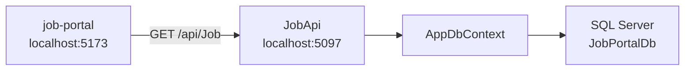

# Job Portal

A small full-stack app: a **React** UI lists job titles from a **.NET Web API**, which reads and writes data in **SQL Server** using **Entity Framework Core**.

| Part | Folder | What it does |
|------|--------|----------------|
| Backend | `JobApi/` | REST API, EF Core, Swagger in Development |
| Frontend | `job-portal/` | React + Vite UI; calls the API with Axios |

---

## How the app works (end-to-end)

1. You open the React app in the browser (`http://localhost:5173`).
2. On load, the UI requests `GET http://localhost:5097/api/Job`.
3. `JobController` asks `AppDbContext` for all rows in the `Jobs` table.
4. SQL Server returns the data; the API sends JSON; React shows each job `title` in a list.



**Important pieces in the backend**

- `Models/Job.cs` — entity (`Id`, `Title`)
- `Data/AppDbContext.cs` — `DbSet<Job> Jobs`
- `Controllers/JobController.cs` — `GET api/Job`
- `Program.cs` — SQL Server connection, CORS for `http://localhost:5173`, controllers, Swagger
- `Migrations/` — database schema history (commit this folder to git)

---

## Prerequisites

Install these once on your machine:

- [.NET SDK](https://dotnet.microsoft.com/download) (this project targets **.NET 10**)
- [SQL Server](https://www.microsoft.com/sql-server) (e.g. **SQL Server Express** as `localhost\SQLEXPRESS`)
- [Node.js](https://nodejs.org/) (LTS) for the frontend

---

## Building this project from scratch (beginner flow)

This is the order of work used while creating the repo—not every step is a single command, but the **commands below match what was run** during setup.

### Phase 1 — Backend API and database

1. **Create the Web API project** (`JobApi`) with controllers and configure `appsettings.json`:

   - Set `ConnectionStrings:DefaultConnection` to your SQL Server instance and database name (`JobPortalDb`).

   Example (Windows authentication):

   ```json
   "DefaultConnection": "Server=localhost\\SQLEXPRESS;Database=JobPortalDb;Trusted_Connection=True;TrustServerCertificate=True"
   ```

2. **Add the EF Core packages** to the API project (runtime + design-time tools):

   ```powershell
   cd JobApi
   dotnet add package Microsoft.EntityFrameworkCore.SqlServer
   dotnet add package Microsoft.EntityFrameworkCore.Tools
   ```

   | Package | Why |
   |---------|-----|
   | `Microsoft.EntityFrameworkCore.SqlServer` | Lets `Program.cs` call `UseSqlServer(...)` |
   | `Microsoft.EntityFrameworkCore.Tools` | Lets `dotnet ef` generate and apply migrations from this project |

3. **Install the EF Core CLI** (once per machine):

   ```powershell
   dotnet tool install --global dotnet-ef
   dotnet ef --version
   ```

   | When | Why |
   |------|-----|
   | Before first migration | `migrations add` and `database update` are separate from `dotnet run` |

4. **Define the model and `AppDbContext`**, register the context in `Program.cs`:

   ```csharp
   builder.Services.AddDbContext<AppDbContext>(options =>
       options.UseSqlServer(builder.Configuration.GetConnectionString("DefaultConnection")));
   ```

5. **Create migrations** (after the model/context exist):

   ```powershell
   cd JobApi
   dotnet ef migrations add InitialCreate
   dotnet ef migrations add CreateJobsTable
   ```

   | Command | When | Why |
   |---------|------|-----|
   | `migrations add InitialCreate` | First time setting up EF migrations | Creates the `Migrations/` folder and baseline migration |
   | `migrations add CreateJobsTable` | After `Job` and `DbSet<Job>` were added/updated | Adds a migration that creates the `Jobs` table |

   On a **fresh clone** of this repo, do **not** run `InitialCreate` or `CreateJobsTable` again—the files are already in git. Only run `migrations add <NewName>` when **you** change models or `AppDbContext`.

6. **Apply migrations to SQL Server** (creates/updates the database):

   ```powershell
   cd JobApi
   dotnet ef database update
   ```

   | When | Why |
   |------|-----|
   | New PC, new database, or after pulling new migrations | Brings the database schema in line with `Migrations/` |

7. **Add `JobController`** and run the API:

   ```powershell
   cd JobApi
   dotnet restore
   dotnet run
   ```

   API base URL (HTTP profile): `http://localhost:5097`  
   Swagger UI (Development): `http://localhost:5097/swagger`

### Phase 2 — Frontend

1. **Create the React + Vite app** in `job-portal/` (scaffold), then install dependencies:

   ```powershell
   cd job-portal
   npm install
   npm install axios
   ```

2. **Call the API** from `src/App.jsx` (`GET /api/Job`). CORS in `Program.cs` must allow `http://localhost:5173`.

3. **Run the UI**:

   ```powershell
   cd job-portal
   npm run dev
   ```

   Open `http://localhost:5173` and confirm job titles appear when the API and database have data.

---

## Run locally after cloning this repo

Someone who only clones git does **not** need to re-run `migrations add`. They need packages restored, the database updated, and both apps running.

**1. Connection string**  
Edit `JobApi/appsettings.json` (or use User Secrets / `appsettings.Development.json`, not committed if it holds secrets) so `DefaultConnection` points to their SQL Server.

**2. Backend**

```powershell
cd JobApi
dotnet restore
dotnet ef database update
dotnet run
```

**3. Frontend**

```powershell
cd job-portal
npm install
npm run dev
```

**4. Optional — seed data**  
If the list is empty, insert rows into `Jobs` (SSMS, Azure Data Studio, or SQL), or extend the API with a POST endpoint later.

---

## Entity Framework command cheat sheet

Commands used while building this project:

| Command | When to use | Why |
|---------|-------------|-----|
| `dotnet tool install --global dotnet-ef` | Once per machine | Installs the `dotnet ef` CLI |
| `dotnet add package Microsoft.EntityFrameworkCore.SqlServer` | Setting up SQL Server with EF | Database provider for `UseSqlServer` |
| `dotnet add package Microsoft.EntityFrameworkCore.Tools` | API project that owns migrations | Design-time support for `dotnet ef` |
| `dotnet ef migrations add <Name>` | After changing models or `AppDbContext` | New migration files under `Migrations/` |
| `dotnet ef database update` | DB missing or out of date | Applies pending migrations to SQL Server |

`git push` shares **code and migrations**; it does **not** upload your SQL Server database. Each environment runs `dotnet ef database update` (or your own deployment process) to create/update tables.

---

## Repository layout

```
.
├── JobApi/                 # ASP.NET Core Web API
│   ├── Controllers/
│   ├── Data/AppDbContext.cs
│   ├── Models/Job.cs
│   ├── Migrations/         # commit to git
│   └── appsettings.json    # connection string (avoid real secrets on public repos)
├── job-portal/             # React + Vite frontend
│   └── src/App.jsx
├── .gitignore              # ignores bin/, obj/, .vs/, node_modules/, etc.
└── README.md
```

---

## Git notes

- Root `.gitignore` excludes Visual Studio `.vs/`, `bin/`, `obj/`, and `node_modules/` so `git add .` does not hit locked IDE files.
- Commit `JobApi/Migrations/` so teammates and future you share the same schema history.

---


